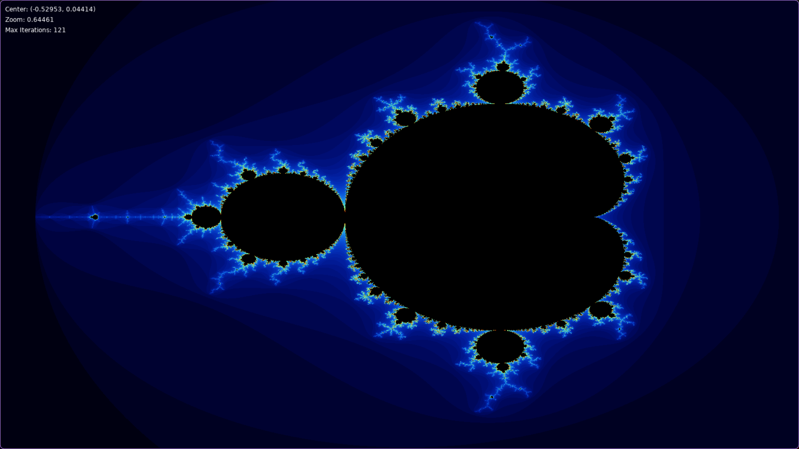
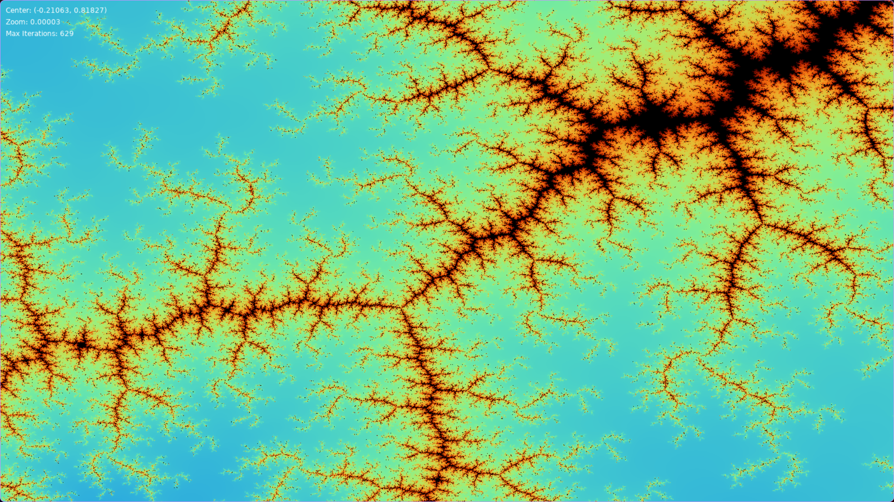
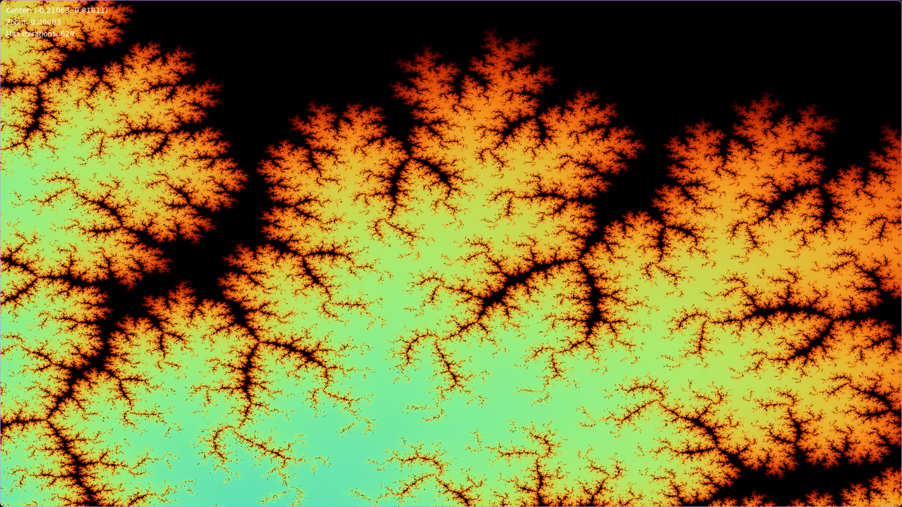
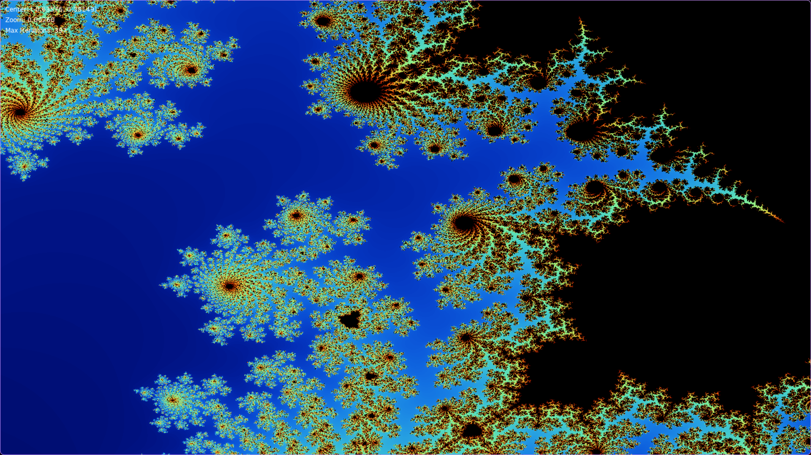
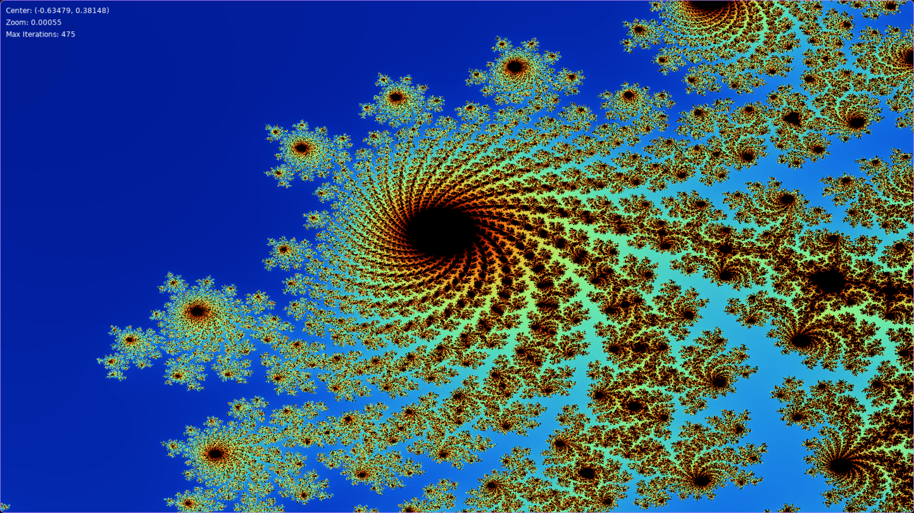
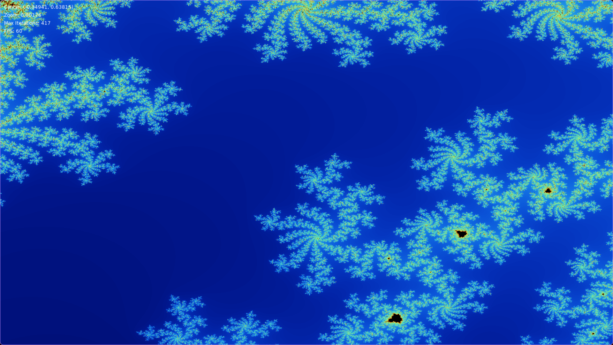

# Mandelbrot in Lua (Love2D)

This project is an interactive Mandelbrot set explorer built using [Love2D](https://love2d.org/).  
You can pan around and zoom into the fractal in real time with keyboard controls. It runs in full-screen and uses a performance-optimized native C library to compute the fractal efficiently.

---

## Screenshots

|  |  |  |
|------------------------------------------|------------------------------------------|------------------------------------------|
|  |  |  |

---

## Controls

| Key | Action           |
|-----|------------------|
| W   | Pan up           |
| A   | Pan left         |
| S   | Pan down         |
| D   | Pan right        |
| Z   | Zoom in          |
| X   | Zoom out         |
| ESC | Quit the program |

---

## How to Run

1. **Install Love2D:**  
   Download and install Love2D from https://love2d.org/ for your platform.

2. **Set up project folder:**  
   Create a folder named `mandelbrot` (or any name you like), and place your `main.lua` file inside it, along with the compiled C shared library (`mandelbrot.dll`, `mandelbrot.so`, or `mandelbrot.dylib` depending on your OS).

3. **Run the project:**  
   - **Option 1:** Drag the folder onto the Love2D executable.
   - **Option 2:** From a terminal, run:
     ```sh
     love mandelbrot/
     ```

---

## Compiling the C Shared Library

The project uses a native C function to speed up Mandelbrot rendering. You must compile the `mandelbrot.c` file into a shared library:

### On Windows (MinGW or MSVC):

```sh
gcc -O3 -shared -o mandelbrot.dll -fPIC mandelbrot.c
```

### On Linux

```sh
gcc -O3 -shared -o mandelbrot.so -fPIC mandelbrot.c
```

### On macOS

```sh
gcc -O3 -shared -o mandelbrot.dylib -fPIC mandelbrot.c
```

Make sure the resulting file is named exactly:

- `mandelbrot.dll` on Windows
- `mandelbrot.so` on Linux
- `mandelbrot.dylib` on macOS

The Lua code will detect your OS and load the appropriate file automatically.

---

## Features

- Full-screen rendering
- Real-time panning and zooming
- Dynamically adjusts iteration count for detail at high zoom
- Colored smooth shading

---

## Performance Optimizations

This project includes several techniques to maximize performance during rendering:

- **Native C backend:** All Mandelbrot calculations are offloaded to a compiled C shared library using LuaJIT FFI.
- **Multithreaded computation:** The native C code computes image rows in parallel using multiple threads.
- **Low-res render buffer:** Internally renders at window resolution and draws to screen as a texture for fast scaling.
- **Dynamic max iterations:** Iteration count automatically increases with zoom for detailed rendering, but is clamped to prevent lag.
- **No offscreen calculation:** The Mandelbrot code only processes pixels that are currently visible.

---

## Requirements

- [Love2D](https://love2d.org/) 11.0 or later
- C compiler

---

## License

This project is released under the MIT License.
